**7天撸完KTV点歌系统,含后台管理系统(完整版)**

## 最近手有点痒琢磨着做个啥,朝思暮想还是写个KTV点歌系统,模拟了一下KTV开户的思路,7天累死我了,不过技术点还挺多的,希望你可以看完（〜^㉨^)〜

**用Node(Express)教你写KTV点歌系统，包括前台内容和后台管理系统，整合Express框架和Mongodb数据库服务器开发；教你用Vue.JS，ElementUI和iViewUI写出超漂亮的页面,随心点歌随心听**

```!
作者原创文章, 转载前请留言或联系作者!!!
```

# 思维导图
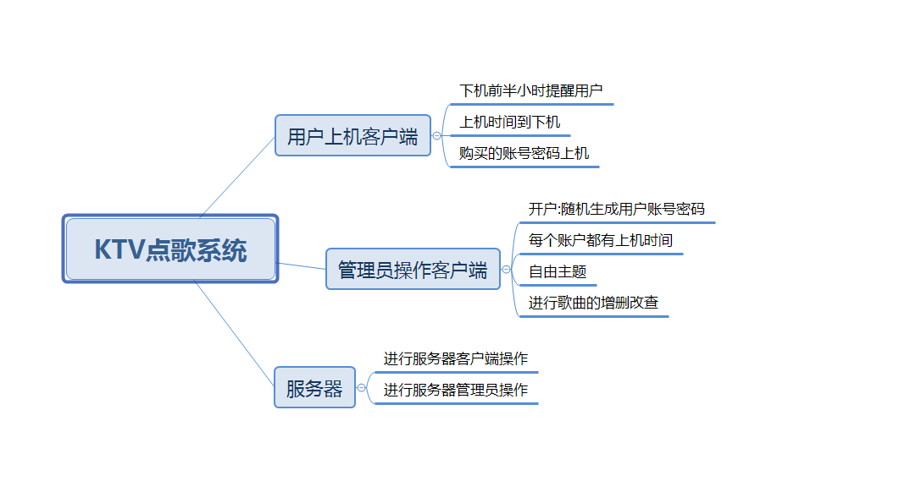

# **技术栈**

* 后端： Express + Mongodb + jsonwebtoken等等

* 前端： Vue.JS + ElementUI + iViewUI + Axios等等

# **功能介绍**

**本项目分前台开发,后台开发和服务器开发**

- 用户听歌需要登录(路由守卫)
- 用户需要到管理员申请账号和密码
- 用户登录听歌(风格点歌,语种点歌,明星点歌,热门歌曲等等...)
- 剩余时长30分钟提醒,到时间自动下机
- 管理员对歌曲的增删改查
- 管理员给用户开户,可以选择上机的时间
- 管理员查看订单,删除订单,搜索订单
- 管理员收藏歌曲,推荐到ktv推荐歌曲
- 等等...

# **项目设计结构**

```
-- 服务器基本架构
ktv-select_music-system
├── README.md
├── index.js  -- 后台文件入口
├── test.http  -- 测试文件
├── api  -- 路由文件
│    ├── admin.js  -- 配置管理员的操作
|    ├── music.js  -- 配置歌曲信息
|    ├── user.js  -- 配置用户的相关操作
|    └── safecode.js  -- 配置安全码
├── config -- 配置
|    ├── Date.js  -- 配置日期格式化插件
|    ├── delNoUse.js  -- 封装闲置删除闲置资源方法
|    ├── http.js  -- 配置跨域
|    ├── isBadAccount.js  -- 封装账户是否合法
|    ├── newaccount.js  -- 封装随机开户方法
|    ├── passport.js  -- 验证token是否合法
|    ├── uploadImg.js  -- 封装上传图片方法
|    └── uploadMusic.js  -- 封装上传歌曲方法
├── ktv-admin  --后台管理系统界面
├── ktv-client  --前台用户点歌项目界面
├── dbModel
|    └── **  -- Mongodb数据库的一些模型
├── mongodb
|    └── mongodb.js  -- 配置Mongodb,链接数据库 
├── secret
|    ├── mongodbURI.js  -- Mongodb地址
|    └── jwtkey.js  -- token的私钥
├── static -- 资源存放处
|    ├── music  -- 歌曲上传目标文件夹 
|    ├── poster  -- 歌曲海报上传目标文件夹
└──  └── view  -- 配置404文件
```


```
-- 后台管理系统架构
ktv-admin
├── README.md
├── public 
|    ├── index.html  -- vue挂载页面
|    └── **  -- 你可以在这里链接少量静态资源
├── src  -- 开发文件夹
|    ├── App.vue  -- Vue挂载根页面
|    ├── main.js  -- Vue程序入口文件,挂载各种组件
|    ├── router.js  -- Vue路由配置文件
|    ├── store.js  -- Vuex的状态管理文件
|    ├── assets  -- 静态资源文件夹
|    ├── components  --公共组件
|    |      └── nav.vue  -- 后台导航栏
|    ├── plugins  --插件
|    |      ├── axios.js   -- 配置跨域,拦截器等等 
|    |      ├── Date.js   -- 格式化日期 
|    |      └── Date.js   -- 加载动画Loading
|    ├── stores  -- 状态管理文件夹
|    |      └── adminStore.js  -- 管理员状态 
|    ├── views  -- 页面文件夹
|    |      ├── 404.vue   -- 404页面
|    |      ├── adminlikes.vue   -- 管理员处理ktv收藏歌曲
|    |      ├── allorders.vue   -- 订单管理
|    |      ├── Home.vue   -- 后台根页面
|    |      ├── Index.vue   -- 后台首页
|    |      ├── managemusic.vue   -- 音乐管理
|    |      ├── user_service.vue   -- 给用户开户
|    |      └── login.vue   -- 后台登录
└── babel.config.js  -- babel配置
```


```

-- 前台用户听歌架构
ktv-client
├── README.md
├── public 
|    ├── index.html  -- vue挂载页面
|    └── **  -- 你可以在这里链接少量静态资源
├── src  -- 开发文件夹
|    ├── App.vue  -- Vue挂载根页面
|    ├── main.js  -- Vue程序入口文件,挂载各种组件
|    ├── router.js  -- Vue路由配置文件
|    ├── store.js  -- Vuex的状态管理文件
|    ├── assets  -- 静态资源文件夹
|    ├── components  --公共组件
|    |      ├── bottomNav.vue  -- 底部音乐控制区域
|    |      └── topNav.vue  -- 顶部信息区域
|    ├── config  --配置
|    |      ├── addSong.js    --封装选取歌曲方法
|    |      ├── isBadAccount.js    --验证账户合法性
|    |      ├── isLogin.js    --是否登录
|    |      ├── nextSong.js    --封装下一首歌曲方法
|    |      └── prevSong.js    --封装上一首歌曲方法
|    ├── plugins  --插件
|    |      ├── axios.js   -- 配置跨域,拦截器等等 
|    |      └── wsmLoading.js   -- 加载动画Loading
|    ├── stores  -- 状态管理文件夹
|    |      └── song.js  -- 存储歌曲信息 
|    ├── views  -- 页面文件夹
|    |      ├── 404.vue   -- 404页面
|    |      ├── abc.vue   -- 拼音点歌
|    |      ├── artist.vue   -- 明星点歌
|    |      ├── Home.vue   -- 后台根页面
|    |      ├── Index.vue   -- 后台首页
|    |      ├── hot.vue   -- 热播歌曲
|    |      ├── ktvlikes.vue   -- ktv推荐歌曲
|    |      ├── selected.vue   -- 已选歌曲
|    |      ├── style.vue   -- 风格点歌
|    |      └── language.vue   -- 语种点歌
├── babel.config.js  -- babel配置
└── vue.config.js  -- vue配置
```

# **项目启动介绍**
1. 首先不要改变服务器端口,否则报错.
2. 你需要在装有Node和Vue的环境中测试，如果其中一个没有请先下载([Node下载](https://nodejs.org/en/),[Vue下载](https://cn.vuejs.org/v2/guide/installation.html)).
3. 首先在最外层文件夹下载依赖:npm install 下载后端依赖, 
4. 接着进入ktv-client, npm install 下载用户前端依赖.
5.  接着进入ktv-admin, npm install 下载管理员前端依赖.
6. 以上工作完成后,使用命令`npm run server 或者 node index &`命令启动Node服务器，启动成功会显示:

    **Server is running on port [8633].**
    
    **Mongodb is Connected.Please have a great coding.**
7. 进入ktv-client,打开命令板,使用命令`npm run client`启动前台用户项目,启动成功后用浏览器访问`http://localhost:xxxx`
8. 进入ktv-admin,打开命令板,使用命令`npm run admin`启动后台管理系统项目,启动成功后用浏览器访问`http://localhost:xxxx`
9. 本例中将Mongodb部署在本地电脑上，如果你仔细阅读了这篇文档，启动项目应该是很容易的。如果你把Mongodb部署在其他地方，请自行修改`secret/mongodbURI.js`配置文件信息。
10.项目启动成功

# 技术攻关
## Date方法
由于脑袋不好使的原因加上js没有元素格式化日期的方法,就瞎掰一个(值得学习)

**Date.js**
```

/** 
*
*  @author: Mr_Wei 
*  @version: 1.0.0 
*  @description: 格式化日期
*  @Date: 2019/10/16 09:32
*
*/ 

Date.prototype.format = function(format) {
    var o = {
		"M+": this.getMonth() + 1, //月份
		"d+": this.getDate(), //日
		"H+": this.getHours(), //小时
		"m+": this.getMinutes(), //分
		"s+": this.getSeconds(), //秒
		"q+": Math.floor((this.getMonth() + 3) / 3), //季度
		"f+": this.getMilliseconds() //毫秒
	};
	if (/(y+)/.test(format))
		format = format.replace(RegExp.$1, (this.getFullYear() + "").substr(4 - RegExp.$1.length));
	for (var k in o)
		if (new RegExp("(" + k + ")").test(format))
			format = format.replace(RegExp.$1, (RegExp.$1.length == 1) ? (o[k]) : (("00" + o[k]).substr(("" + o[k]).length)));
	return format;
}

export default Date.prototype.format


然后我们使用其格式日期
require(Date);
// const now = new Date().format("yyyy/MM/dd HH:mm:ss.S");
const now = new Date().format("yyyy/MM/dd HH:mm:ss");

```

## 验证码(svg-captcha)
svg-captcha验证码的运用,防止暴力破解密码,加强安全性.
详细的文档地址：[svg-captcha](https://www.npmjs.com/package/svg-captcha)

**使用验证码**
```
// 后台生成验证码
router.get("/getCaptcha", (req, res) => {
    var captcha = svgCaptcha.create({  
        // 翻转颜色  
        inverse: false,  
        // 字体大小  
        fontSize: 38,  
        // 噪声线条数  
        noise: 3,  
        // 宽度  
        width: 80,  
        // 高度  
        height: 32,  
      });  
      // 保存到session,忽略大小写  
      req.session = captcha.text.toLowerCase(); 
      console.log(req.session); //0xtg 生成的验证码
      //保存到cookie 方便前端调用验证
      res.cookie('captcha', req.session); 
      res.setHeader('Content-Type', 'image/svg+xml');
      res.send(String(captcha.data));
      res.end();
})


// 前台获取验证码
--HTML


--js
// 获取验证码cookie
getCookie(cname){
    var name = cname + "=";
    var ca = document.cookie.split(';');
    for(var i=0; i<ca.length; i++){
        var c = ca[i].trim();
        if (c.indexOf(name)==0) return c.substring(name.length,c.length);
    }
    return "";
},
// 刷新验证码
refreshCaptcha(){
    this.$refs.captcha.src = "http://localhost:3001/api/user/getCaptcha?d=" + Math.random();
},

最后用 填写的验证码进行对比
```

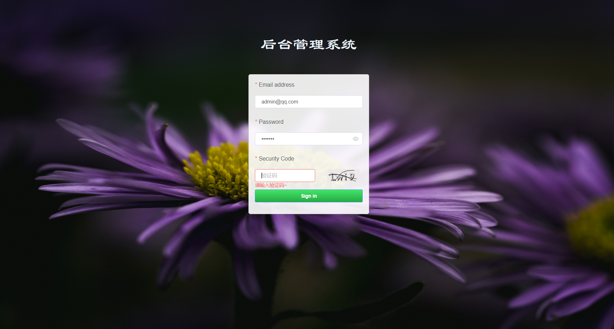

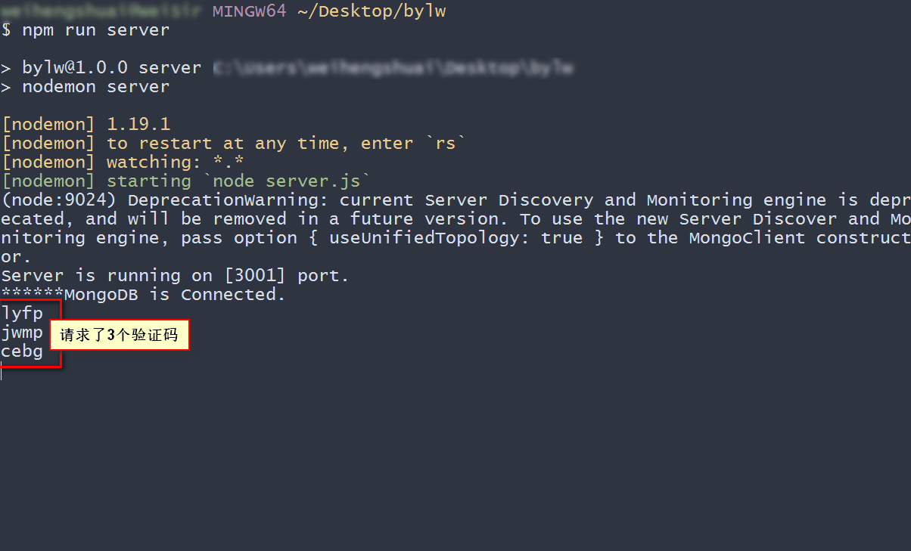

# 上传歌曲或图片
formidable来处理文件上传信息,用起来方便,很友好,如果你没有接触过文件操作,赶紧收藏起来

**封装歌曲方法uploadMusic.js**
```
/** 
*
*  @author: Mr_Wei 
*  @version: 1.0.0 
*  @description: 封装上传音乐方法
*  @Date: 2019/10/16 08:35
*
*/ 

const fs = require('fs');
const path = require('path');
const formidable = require('formidable');  // 文件处理库
const formatTime = require('silly-datetime');  // 格式化数据

module.exports = (req, res) => {
    
    let form = new formidable.IncomingForm();  //创建上传表单
    form.encoding = 'utf-8';  // 设置编码格式
    form.uploadDir = path.join(__dirname, '../static/music'); // 设置上传目录(这个目录必须先创建好)
    form.keepExtensions = true;  // 保留文件后缀名
    form.maxFieldsSize = 20 * 1024 *1024; // 设置文件大小

    /* 格式化form数据 */
    form.parse(req, (err, fields, files) => {
        let file = files.file;
        /* 获取异常 */
        if(err) {
            return res.status(500).json({'status': 500, result: '服务器内部错误'});
        }
        if(file.size > form.maxFieldsSize) {
            fs.unlink(file.path);
            return res.status(412).json({'status': 412, result: '音频不能超过20M'});
        }

        /* 存储后缀名 */
        let extName = '';
        switch (file.type) {
            case 'audio/mp3':
                extName = 'mp3';
                break;
        }
        if(extName.length == 0) {
            fs.unlink(file.path);
            return res.status(412).json({'status': 412, result: '只支持mp3格式音频'});
        }
        /* 拼接新的文件名 */
        let time = formatTime.format(new Date(), 'YYYYMMDDHHmmss');
        let num = Math.floor(Math.random() * 8999 + 10000);
        let songName = `${time}_${num}.${extName}`;
        let newPath = form.uploadDir + '/' + songName;

        /* 更改名字和路径 */
        fs.rename(file.path, newPath, (err) => {
            if(err) {
                return res.status(500).json({'status': 500, result: '音频上传失败'});
            } else {
                return res.send({'status': 200, 'msg': '音频上传成功', result: {src: songName}});
            }
        })
        
    })
};
```

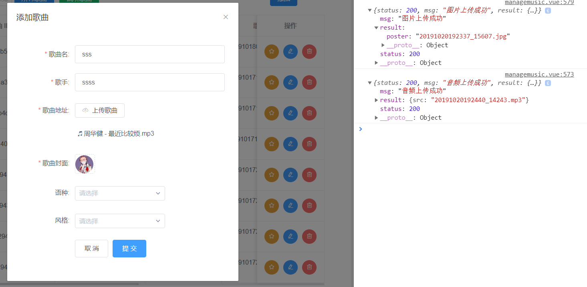

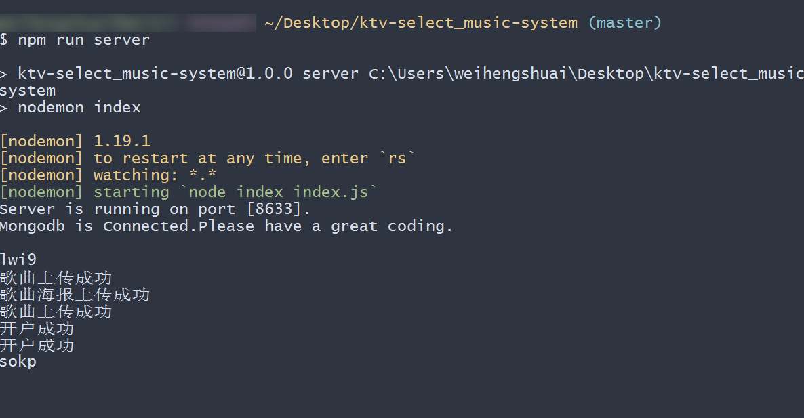

# Vue、ElementUI分页使用

关于ElementUI分页详细请见：[ElementUI的Pagination分页学习](https://element.eleme.cn/#/zh-CN/component/pagination)

**上图**
```
-- html
<el-pagination
    v-if='paginations.total > 0'
    :page-sizes="paginations.page_sizes"
    :page-size="paginations.page_size"
    :layout="paginations.layout"
    :total="paginations.total"
    :current-page.sync='paginations.page_index'
    @current-change='handleCurrentChange'
    @size-change='handleSizeChange'>
</el-pagination>

-- js
data(){
    return{
        allUsers:[],  // 用来存储最终信息, 被显示的dom点调用
        allTableData:[],  // 用户承接分页设置的数据
        paginations: {   // 分页组件信息
            page_index: 1, // 当前位于哪页
            total: 0, // 总数
            page_size: 5, // 1页显示多少条
            page_sizes: [5, 10, 15, 20], //每页显示多少条
            layout: "total, sizes, prev, pager, next, jumper" // 翻页属性
        },
    }
},
methods:{
    // 获取当前页
    handleCurrentChange(page) {
        let sortnum = this.paginations.page_size * (page - 1);
        let table = this.allTableData.filter((item, index) => {
            return index >= sortnum;
        });
        // 设置默认分页数据
        this.getAllUsers = table.filter((item, index) => {
            return index < this.paginations.page_size;
        });
        this.getAllUsers = table.filter((item, index) => {
            return index < this.paginations.page_size;
        });
    },
    // 切换size
    handleSizeChange(page_size) {
        this.paginations.page_index = 1;
        this.paginations.page_size = page_size;
        this.getAllUsers = this.allTableData.filter((item, index) => {
            return index < page_size;
        });
    },
     // 总页数
    setPaginations() {
        this.paginations.total = this.allTableData.length;
        this.paginations.page_index = 1;
        this.paginations.page_size = 5;
        // 设置默认分页数据
        this.getAllUsers = this.allTableData.filter((item, index) => {
            return index < this.paginations.page_size;
        });
    },
}
```


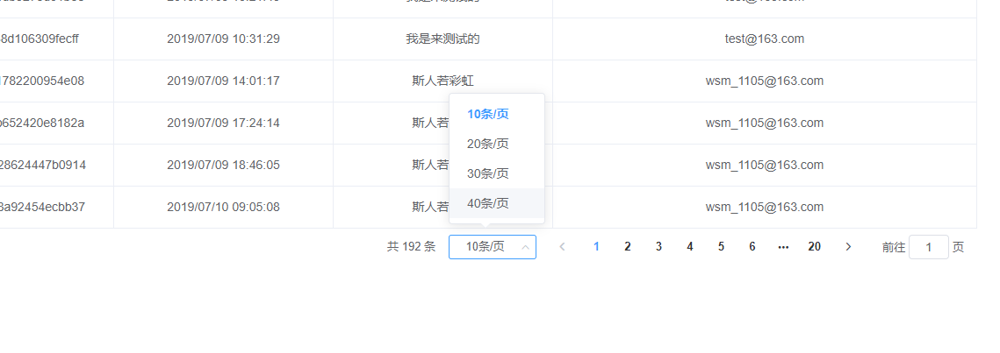

>没了吗?对,分页就是这么简单!你学会了吗?有些前端开发的同学总是对分页比较陌生,学会这个,让你不再产生烦恼!

# token和自定义验证合法性
jsonwebtoken是对用户信息加密成不可逆向破解的token.关于passport-jwt，是用来对用户请求时所带的token信息进行过期验证,如果超过签证的合法时间,则会请前台发出token失效的信息,提示用户重新获取合法的token信息,否则无法继续请求加密的信息；

**用法**
```
- passport-jwt
const key = require("../config/keys").KEYORSECRET;
const JwtStrategy = require('passport-jwt').Strategy,
      ExtractJwt = require('passport-jwt').ExtractJwt;
var opts = {}
opts.jwtFromRequest = ExtractJwt.fromAuthHeaderAsBearerToken();
opts.secretOrKey = key;

module.exports = passport => {
    passport.use(new JwtStrategy(opts, (jwt_payload, done) => {
        UserInfo.findById(jwt_payload.id)
                .then(user => {
                    if (user) {
                        return done(null, user);
                    } else {
                        return done(null, false);
                        // or you could create a new account
                    }
                })
    }));
}


// 设置token
// 规则
 const rule = {
    id:String(userinfo._id),
    username:userinfo.username,
    email:userinfo.email,
    date:user.date,
    signdate:userinfo.signdate,
    signcount:userinfo.signcount,
    avatar:userinfo.avatar,
    phone:userinfo.phone
};

// 签证加密
// jwt.sign(规则, key(私钥), {配置:比如过期时长}, (err, token){ 响应程序 })
jwt.sign(rule,key,{expiresIn:7200},(err, token) => {
    if(err) throw err;
    res.json({"token" : "Bearer " + token})
})


自定义验证方法
/** 
*
*  @author: Mr_Wei 
*  @version: 1.0.0 
*  @description: 判断是否过期用户
*  @Date: 2019/10/19 12:19
*
*/ 
const UserOrOrders = require("../dbModel/user");
module.exports = async params => {
    
    
    const flag = await new Promise((resolve) => {
        if(params){
            const account = params.account;
            UserOrOrders.findOne({account})
                .then(user => {
                    if(user){
                        if(new Date().getTime() > new Date(user.endTime).getTime()){
                            console.log("过期用户");
                            // 处理
                            return resolve(false);
                        }else{
                            console.log("合法用户");
                            return resolve(true);
                        }
                    }else{
                        return resolve(false);
                    }
                })
        }else{
            console.log("不合法用户");
            return resolve(false);
        }
        
    }) 
    return flag;
}


使用:
// 测试  isBadAccount(params)方法
router.post("/test", passport.authenticate("jwt", {session:false}), async (req, res) => {
    // console.log(req.user)
    if(await isBadAccount(req.user)){
        // do something
        res.send("OK");
    }else{
        res.status(401).json({status:"401", result:"帐号过期,请联系管理员"})
    }
})


```
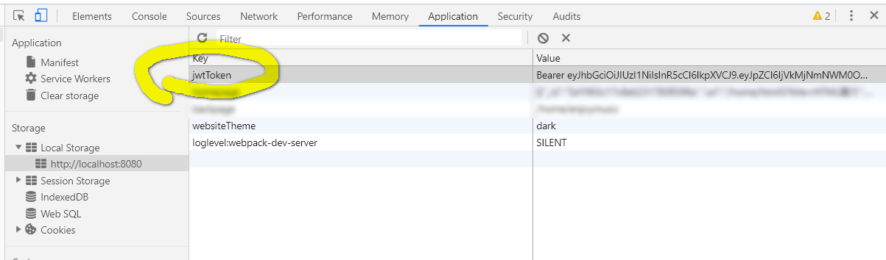
详细的文档地址：[Passport-Jwt合法验证](https://www.npmjs.com/package/passport-jwt),[token加密](https://www.npmjs.com/package/jsonwebtoken)

# 截图
## 后台管理系统
- 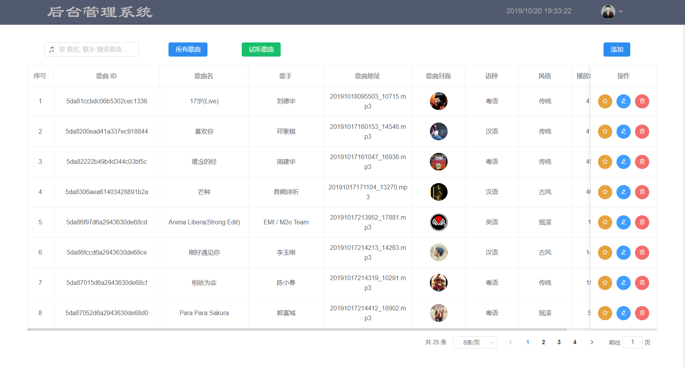


- 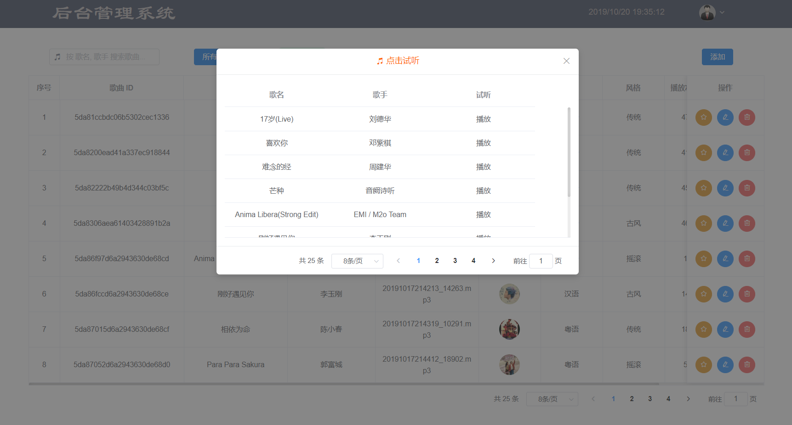


- 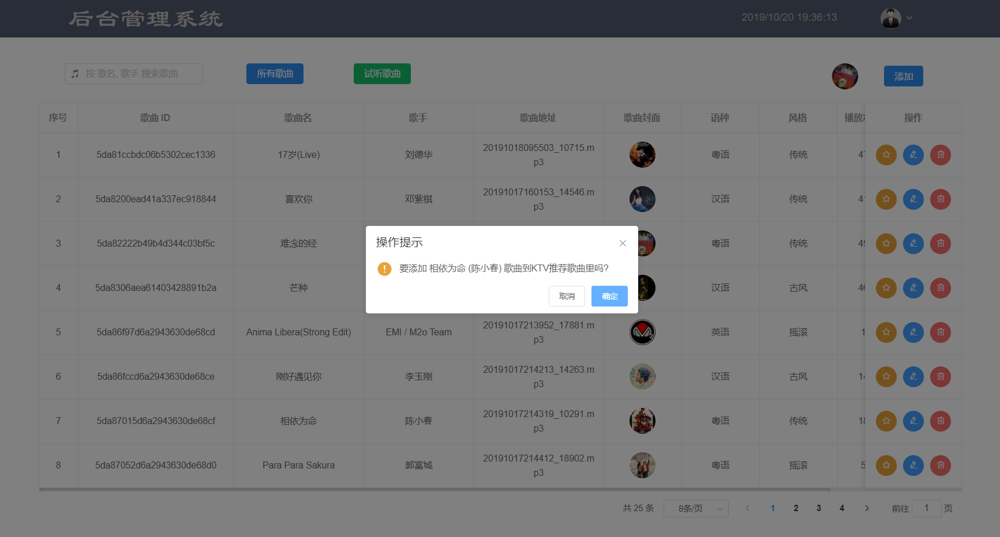


- 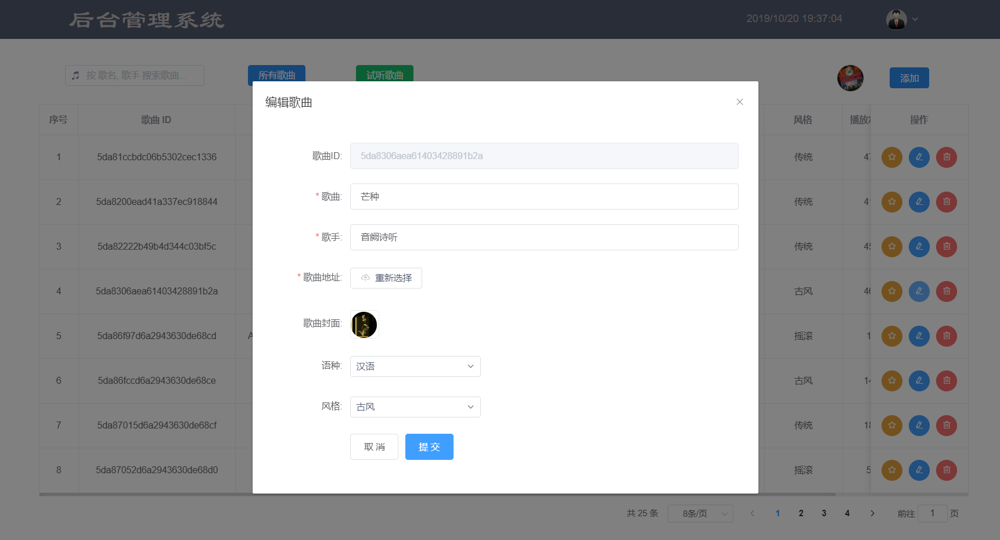


- 


- 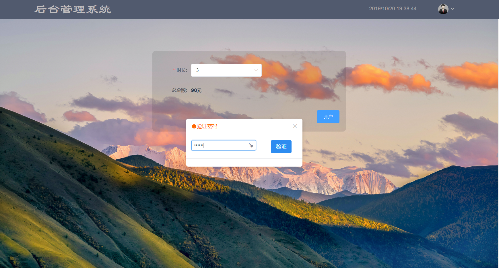


- 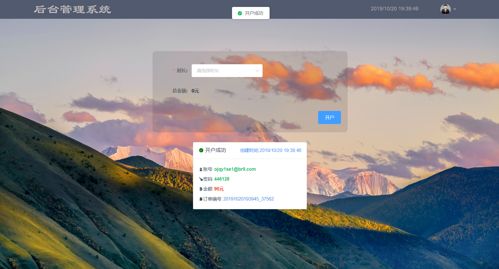

- 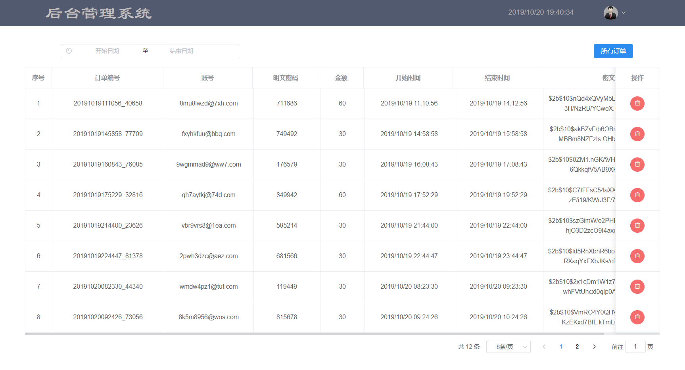

## 前台点歌界面
- 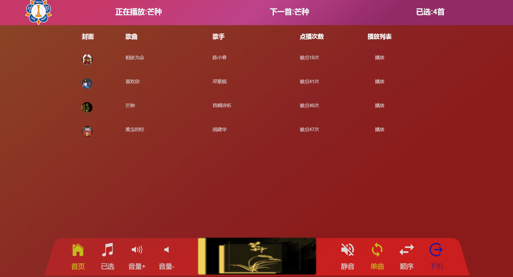


- 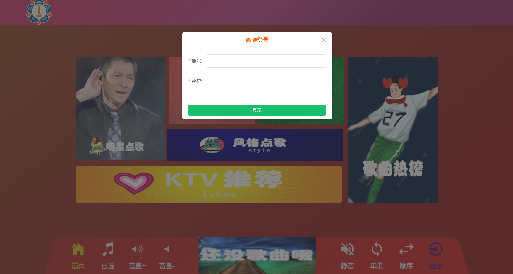


- 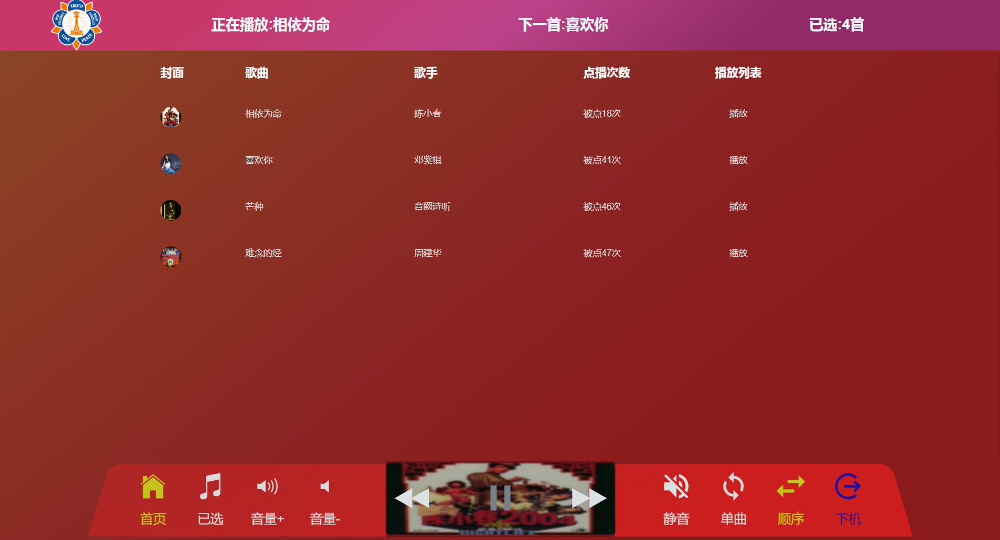


- 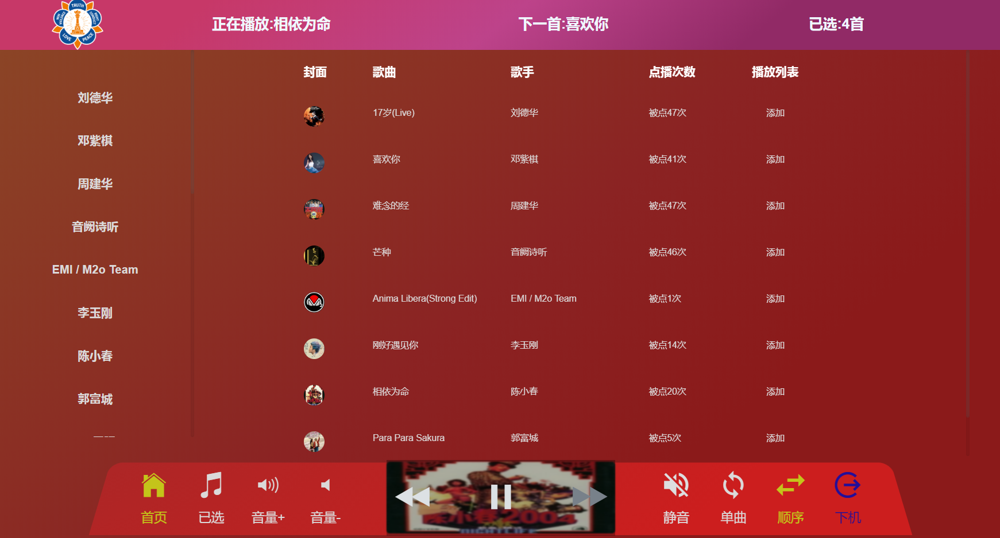


- 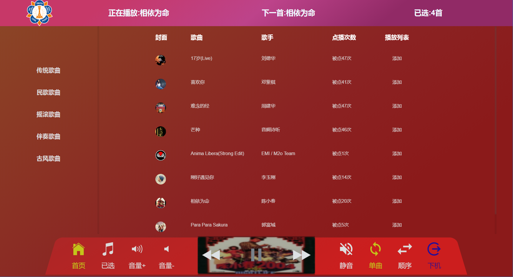


# 源码在这里
以上代码均已上传 github

[https://github.com/1046224544/ktv-select_music-system](https://github.com/1046224544/ktv-select_music-system)

# 联系

如果大家有兴趣，[欢迎star](https://github.com/1046224544/ktv-select_music-system). 欢迎大家加入我的前端交流群：866068198 ，一起交流学习前端技术。博主目前一直在自学Node中，技术有限，如果可以，会尽力给大家提供一些帮助，或是一些学习方法.
- 群二维码


# 其他
- **Node-vue-iView开发类似博客的综合性网站** [https://juejin.im/post/5da2a8ed6fb9a04de818eeff](https://juejin.im/post/5da2a8ed6fb9a04de818eeff)


# 最后
If you have some questions after you see this article, you can contact me or you can find some info by clicking these links.

- [juejin@wsm's juejin](https://juejin.im/user/5d1079ab6fb9a07ed4410cc0)
- [GitHub@1046224544](https://github.com/1046224544)
- [Segmentfault@wsm](https://segmentfault.com/u/xiaolajiao_5d81dbf1f09b2)


>**如果对你有帮助,请赏个star~** [github地址](https://github.com/1046224544/ktv-select_music-system)
